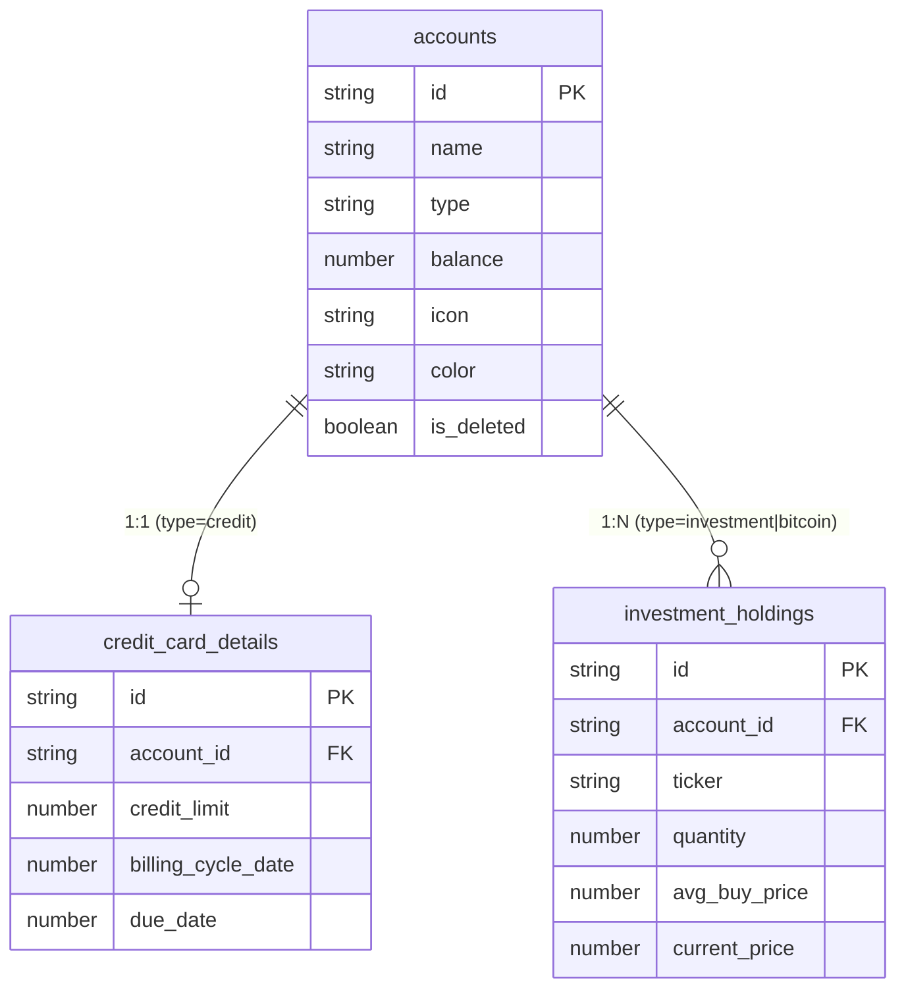
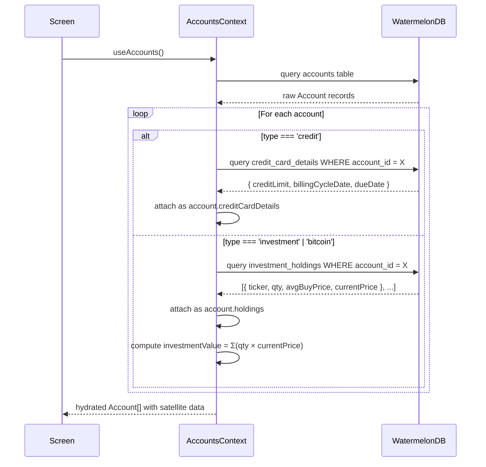
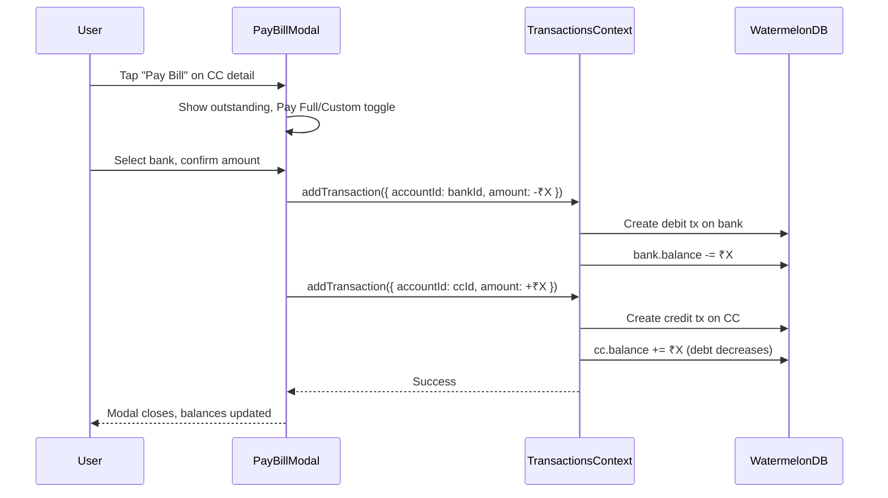

# Accounts Architecture

> How Sikka models bank accounts, credit cards, investments, and crypto wallets.

---

## Account Type System

Sikka supports **7 account types**, grouped into 3 financial categories:

| Category | Types | Net Worth Contribution |
|---|---|---|
| **Liquid** | `bank`, `cash`, `wallet`, `savings` | `+ balance` |
| **Liability** | `credit` | `− abs(balance)` (debt) |
| **Investment** | `investment`, `bitcoin` | `Σ(qty × currentPrice)` |

```typescript
export type AccountType = 'bank' | 'cash' | 'bitcoin' | 'credit' | 'investment' | 'savings' | 'wallet';
```

---

## Data Model

The `Account` interface is a **flat object** with optional satellite data bolted on via discriminated fields:

```typescript
interface Account {
    id: string;
    name: string;
    type: AccountType;
    balance: number;        // For CC: this is outstanding debt (negative conceptually)
    icon: string;
    color: string;
    isDeleted?: boolean;    // Soft-delete flag

    // Satellite data (hydrated from separate DB tables)
    creditCardDetails?: CreditCardDetails;    // Only when type='credit'
    holdings?: InvestmentHoldingData[];        // Only when type='investment'|'bitcoin'
    investmentValue?: number;                 // Σ(qty × currentPrice)
}
```

---

## Satellite Table Pattern

Instead of one giant accounts table with nullable columns, Sikka uses **satellite tables** — separate 1:1 or 1:N tables that store type-specific data:



### Why Satellite Tables?

- **No NULL bloat** — liquid accounts don't carry empty `credit_limit` fields
- **Clean querying** — `Q.where('account_id', id)` fetches related data
- **Independent scaling** — holdings can grow per account without account table bloat

---

## Account Hydration

When loading accounts from WatermelonDB, `hydrateAccount()` in `AccountsContext.tsx` enriches the raw DB record with satellite data:



### Hydration Code (simplified)

```typescript
async function hydrateAccount(acc: Account): Promise<AccountType> {
    const base = { id: acc.id, name: acc.name, type: acc.type, balance: acc.balance, ... };

    if (acc.type === 'credit') {
        const ccRecords = await db.get('credit_card_details')
            .query(Q.where('account_id', acc.id)).fetch();
        if (ccRecords.length > 0) {
            base.creditCardDetails = {
                creditLimit: ccRecords[0].creditLimit,
                billingCycleDate: ccRecords[0].billingCycleDate,
                dueDate: ccRecords[0].dueDate,
            };
        }
    }

    if (acc.type === 'investment' || acc.type === 'bitcoin') {
        const holdings = await db.get('investment_holdings')
            .query(Q.where('account_id', acc.id)).fetch();
        base.holdings = holdings.map(h => ({ ... }));
        base.investmentValue = holdings.reduce((s, h) => s + h.quantity * h.currentPrice, 0);
    }

    return base;
}
```

---

## Net Worth — Strategy Pattern

Net worth calculation uses the **Strategy Pattern** (Open/Closed Principle). Each account type defines a function that returns its contribution to net worth:

```typescript
export const NET_WORTH_STRATEGIES: Record<AccountType, NetWorthStrategy> = {
    bank:       (a) => a.balance,                          // Positive asset
    cash:       (a) => a.balance,
    wallet:     (a) => a.balance,
    savings:    (a) => a.balance,
    credit:     (a) => -Math.abs(a.balance),               // Debt subtracts
    investment: (a) => a.investmentValue ?? a.balance,     // Portfolio value
    bitcoin:    (a) => a.investmentValue ?? a.balance,
};

export function computeNetWorth(activeAccounts: Account[]): number {
    return activeAccounts.reduce((total, acc) => {
        const strategy = NET_WORTH_STRATEGIES[acc.type];
        return total + (strategy ? strategy(acc) : acc.balance);
    }, 0);
}
```

### Adding a New Account Type

To add e.g. `gold` as a new type:

1. Add `'gold'` to the `AccountType` union in `types/index.ts`
2. Add a strategy: `gold: (a) => a.balance` in `NET_WORTH_STRATEGIES`
3. Add metadata in `ACCOUNT_TYPE_META[]`
4. **Zero changes** to `computeNetWorth()` or any existing strategy — **Open/Closed Principle**

---

## Credit Card Balance Semantics

Credit card `balance` uses **inverted semantics** compared to liquid accounts:

| Action | Liquid Account | Credit Card |
|---|---|---|
| Spend ₹500 | `balance -= 500` | `balance -= (-500)` → `balance += 500` (debt increases) |
| Receive ₹500 | `balance += 500` | `balance += 500` (debt decreases) |
| Display outstanding | N/A | `Math.abs(balance)` |
| Available credit | N/A | `creditLimit - Math.abs(balance)` |

The key formula in `TransactionsContext.addTransaction`:

```typescript
if (account.type === 'credit') {
    acc.balance -= transactionData.amount;   // Expense: amount is -500, so balance += 500
} else {
    acc.balance += transactionData.amount;   // Expense: amount is -500, so balance -= 500
}
```

---

## Credit Card Utilization

Computed on-the-fly from balance and credit limit:

```typescript
function computeCreditUtilization(balance: number, creditLimit: number): CreditUtilization {
    const used = Math.abs(balance);
    const available = Math.max(0, creditLimit - used);
    const percent = creditLimit > 0 ? (used / creditLimit) * 100 : 0;

    let status = 'safe';       // < 30%
    if (percent > 60) status = 'danger';
    else if (percent > 30) status = 'warning';

    return { used, limit: creditLimit, available, percent, status };
}
```

Displayed as a **color-coded utilization bar** on both the Dashboard and Account Detail screens:
- 🟢 **Safe** — under 30%
- 🟡 **Warning** — 30–60%
- 🔴 **Danger** — over 60%

---

## CC Bill Payment Flow

The `PayBillModal` component creates **2 linked transactions** (same as a transfer):



---

## Investment P&L Computation

```typescript
function computePortfolioPnL(holdings: InvestmentHoldingData[]): PortfolioPnL {
    const holdingPnLs = holdings.map(h => {
        const currentValue = h.quantity * h.currentPrice;
        const investedValue = h.quantity * h.avgBuyPrice;
        return {
            holding: h,
            currentValue,
            investedValue,
            pnl: currentValue - investedValue,
            pnlPercent: investedValue > 0 ? ((currentValue - investedValue) / investedValue) * 100 : 0,
        };
    });

    return {
        holdings: holdingPnLs,
        totalValue: Σ(currentValue),
        totalInvested: Σ(investedValue),
        totalPnL: totalValue - totalInvested,
        pnlPercent: (totalPnL / totalInvested) × 100,
    };
}
```

---

## Context API

The `AccountsContext` provides:

| Method | Description |
|---|---|
| `addAccount(data, ccDetails?, holdings?)` | Creates account + satellite rows in a single DB write |
| `deleteAccount(id)` | Soft-delete (sets `is_deleted = true`) |
| `restoreAccount(id)` | Undeletes |
| `updateAccount(id, updates)` | Partial update |
| `getAccount(id)` | Lookup by ID |
| `getCreditUtilization(id)` | Returns utilization metrics for a CC |
| `getPortfolioPnL(id)` | Returns portfolio P&L for an investment account |
| `addHolding / updateHolding / deleteHolding` | CRUD on investment holdings |

### Computed Properties

| Property | Computation |
|---|---|
| `activeAccounts` | `accounts.filter(a => !a.isDeleted)` |
| `totalBalance` | `Σ(activeAccounts.balance)` (legacy, simple sum) |
| `netWorth` | `computeNetWorth(activeAccounts)` using strategy pattern |
