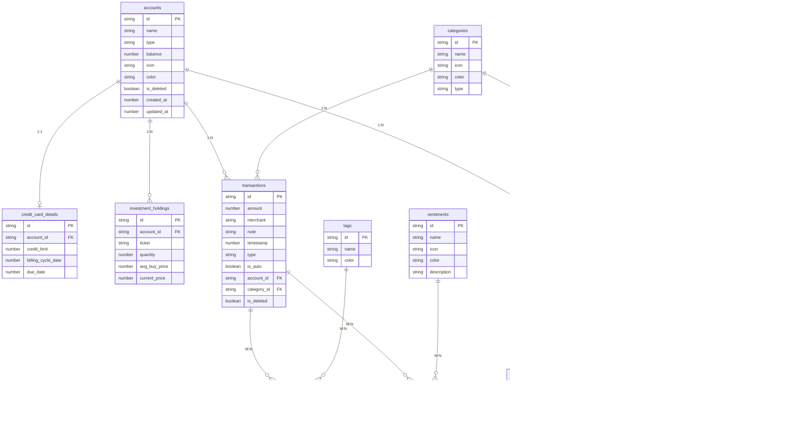

# Database Schema

> All 15 WatermelonDB tables, their relationships, and design rationale.

---

## Overview

Sikka uses [WatermelonDB](https://nozbe.github.io/WatermelonDB/) with an SQLite adapter. The schema is defined in `src/database/schema.ts` and all 15 model classes live in `src/database/models/`.

---

## Complete ER Diagram



---

## Table Groups

### 1. Core Financials

| Table | Purpose | Relationships |
|---|---|---|
| `accounts` | All financial accounts | → credit_card_details (1:1), → investment_holdings (1:N), → transactions (1:N) |
| `credit_card_details` | CC-specific fields (limit, due date) | ← accounts (FK: account_id) |
| `investment_holdings` | Individual stock/crypto holdings | ← accounts (FK: account_id) |
| `transactions` | Every financial transaction | ← accounts (FK: account_id), ← categories (FK: category_id) |
| `categories` | Transaction/subscription categories | → transactions, → subscriptions |

### 2. Metadata & Tagging

| Table | Purpose | Relationships |
|---|---|---|
| `tags` | User-defined labels | → transaction_tags (M:N join) |
| `sentiments` | Emotional tags (Joy, Regret, Impulse) | → transaction_sentiments (M:N join) |
| `transaction_tags` | Join table: transactions ↔ tags | FK: transaction_id, tag_id |
| `transaction_sentiments` | Join table: transactions ↔ sentiments | FK: transaction_id, sentiment_id |

### 3. Subscriptions

| Table | Purpose | Relationships |
|---|---|---|
| `subscriptions` | Recurring payments | ← accounts (FK: account_id), ← categories (FK: category_id) |
| `subscription_members` | People splitting a subscription cost | ← subscriptions (FK: subscription_id) |
| `subscription_events` | Immutable lifecycle log | ← subscriptions (FK: subscription_id) |

### 4. Utilities & Settings

| Table | Purpose |
|---|---|
| `unparsed_messages` | SMS/notifications that failed to parse |
| `settings` | Key-value store (currency, theme, etc.) |
| `users` | User profile + onboarding status |

---

## Indexed Columns

Performance-critical columns with `isIndexed: true`:

```
credit_card_details.account_id     → Fast CC detail lookup by account
investment_holdings.account_id     → Fast holdings lookup by account
transactions.account_id            → Fast transaction list per account
transactions.category_id           → Fast category filtering
transaction_tags.transaction_id    → Fast tag lookup per transaction
transaction_tags.tag_id            → Fast transaction lookup per tag
transaction_sentiments.*           → Same M:N pattern
subscriptions.account_id           → Fast source account lookup
subscriptions.category_id          → Fast category filtering
subscription_members.subscription_id → Fast member lookup
subscription_events.subscription_id  → Fast event log lookup
settings.key                       → Fast key-value lookup
```

---

## Database Initialization

```typescript
// src/database/index.ts
const adapter = new SQLiteAdapter({
    schema: mySchema,
    onSetUpError: error => console.error('Database setup error:', error),
});

const database = new Database({
    adapter,
    modelClasses: [
        Account, Category, Transaction, Tag, Sentiment,
        TransactionTag, TransactionSentiment,
        Subscription, SubscriptionMember, SubscriptionEvent,
        UnparsedMessage, Setting, User,
        CreditCardDetail, InvestmentHolding,
    ],
});
```

---

## Seeding

`src/database/seed.ts` pre-populates:
- **10 transaction categories** (groceries, dining, transport, etc.)
- **6 sentiments** (Joy, Regret, Impulse, Necessity, Gift, Investment)

Seeding is idempotent — it checks if data already exists before inserting.

---

## Soft Deletes

Both `accounts` and `transactions` use **soft deletes** (`is_deleted: boolean`). This means:
- Data is never physically removed
- Deleted items are filtered out in context providers
- Can be restored (accounts support `restoreAccount`)
- Backup/export includes deleted records for recovery

---

## Wipe Database

For development or account reset:

```typescript
export async function wipeDatabase() {
    await database.write(async () => {
        await database.unsafeResetDatabase();
    });
}
```

> ⚠️ This completely destroys all data. Only used during onboarding reset or debug.
