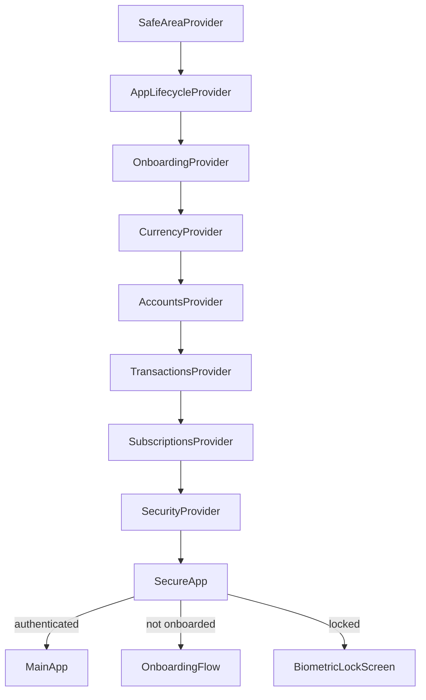
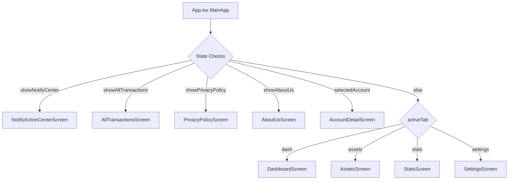
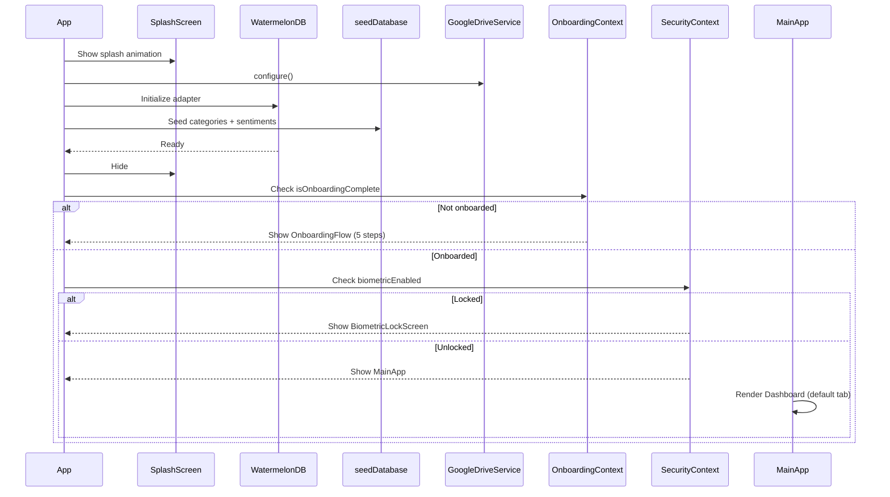

# State Management & Navigation

> How Sikka manages app-wide state, provider nesting, and screen routing.

---

## Architecture: Context-Only State

Sikka uses **React Context API exclusively** — no Redux, MobX, or Zustand. Each domain has a dedicated context provider.

---

## Provider Tree

The provider nesting order in `App.tsx` matters because inner providers can depend on outer ones:



### Why This Order?

| Provider | Depends On |
|---|---|
| `CurrencyProvider` | Nothing (standalone) |
| `AccountsProvider` | Nothing (standalone) |
| `TransactionsProvider` | Nothing (standalone, but conceptually needs accounts) |
| `SubscriptionsProvider` | `TransactionsProvider` (for payment sync) |
| `SecurityProvider` | `OnboardingProvider` (biometric setup happens in onboarding) |

---

## The 9 Context Providers

### 1. `AccountsContext`
**State:** List of accounts with satellite data (CC details, holdings)

| Key | Type | Description |
|---|---|---|
| `accounts` | `Account[]` | All accounts (including deleted) |
| `activeAccounts` | `Account[]` | Non-deleted accounts |
| `netWorth` | `number` | Strategy-computed net worth |
| CRUD methods | — | `addAccount`, `deleteAccount`, `updateAccount`, etc. |

### 2. `TransactionsContext`
**State:** All transactions with real-time DB subscription

| Key | Type | Description |
|---|---|---|
| `transactions` | `Transaction[]` | All transactions |
| `activeTransactions` | `Transaction[]` | Non-deleted, sorted desc |
| `todayTransactions` | `Transaction[]` | Today's activity |
| CRUD methods | — | `addTransaction`, `deleteTransaction`, etc. |
| `unparsedNotifications` | `string[]` | Failed SMS parses |

### 3. `SubscriptionsContext`
**State:** Recurring payments with split billing and lifecycle

| Key | Type | Description |
|---|---|---|
| `subscriptions` | `Subscription[]` | All subscriptions |
| `activeSubscriptions` | `Subscription[]` | Status = active |
| `totalMonthlyBurn` | `number` | Monthly + yearly/12 |
| CRUD + lifecycle | — | `pause`, `archive`, `markAsPaid`, etc. |

### 4. `CurrencyContext`
**State:** Selected currency, number formatting

| Key | Type | Description |
|---|---|---|
| `currency` | `CurrencyCode` | 'INR', 'USD', etc. |
| `formatAmount(n)` | `function` | Formats with symbol + number system |
| `numberSystem` | `'lakhs' \| 'millions'` | Indian vs Western grouping |

### 5. `SecurityContext`
**State:** Biometric authentication

| Key | Type | Description |
|---|---|---|
| `biometricEnabled` | `boolean` | User opted in? |
| `isAuthenticated` | `boolean` | Passed auth this session? |
| `authenticate()` | `function` | Triggers biometric prompt |

### 6. `OnboardingContext`
**State:** First-launch onboarding wizard (5 steps)

| Key | Type | Description |
|---|---|---|
| `currentStep` | `1-5` | Which onboarding screen |
| `isOnboardingComplete` | `boolean` | All steps done? |
| `onboardingData` | `OnboardingData` | Collected preferences |

### 7. `NavigationContext`
**State:** Screen routing and modal visibility

| Key | Description |
|---|---|
| `selectedAccount` | Which account detail is open |
| `showAddModal` | Add/Edit Account modal |
| `showAddTransactionModal` | Add Transaction modal |
| `showAllTransactions` | All Transactions screen |
| `showNotifyCenter` | Notification Action Center |
| `selectedSubscription` | Subscription detail/edit modal |

### 8. `SettingsContext`
**State:** App preferences (persisted to WatermelonDB `settings` table)

### 9. `AppLifecycleContext`
**State:** App reset functionality, provides `onReset` callback

---

## Navigation Model

Sikka uses **state-based navigation** — no React Navigation router. The active screen is determined by state flags:



### Tab Bar

The `TabBar` component is shown only when no overlay screen is active:

```typescript
const showTabBar = !selectedAccount
    && !showAllTransactions
    && !showNotifyCenter
    && !showPrivacyPolicy
    && !showAboutUs;
```

### Modals (Overlays)

Modals render as portal-like overlays in `MainApp`, always present but conditionally visible:

```
<AddAccountModal visible={showAddModal} />
<AddTransactionModal visible={showAddTransactionModal} />
<AddSubscriptionModal visible={showAddSubscriptionModal} />
<EditSubscriptionModal visible={!!selectedSubscription} />
<PayBillModal visible={payBillVisible} />   // (inside AccountDetailScreen)
```

---

## Screen Transitions

Animated using `Animated.parallel` with fade + slide:

```typescript
useEffect(() => {
    fadeAnim.setValue(0);
    slideAnim.setValue(20);
    Animated.parallel([
        Animated.timing(fadeAnim, { toValue: 1, duration: 300, useNativeDriver: true }),
        Animated.spring(slideAnim, { toValue: 0, friction: 8, tension: 40, useNativeDriver: true }),
    ]).start();
}, [activeTab, selectedAccount, showAllTransactions, showNotifyCenter]);
```

---

## App Boot Sequence


