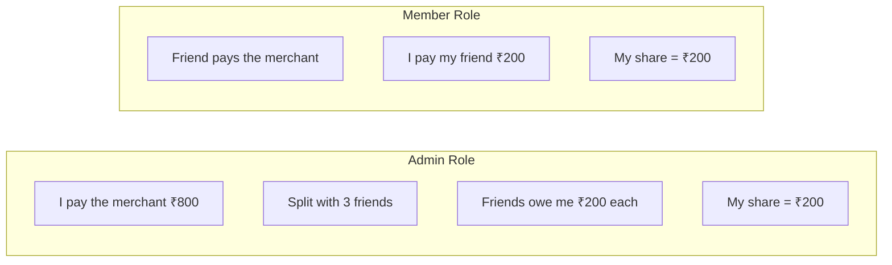
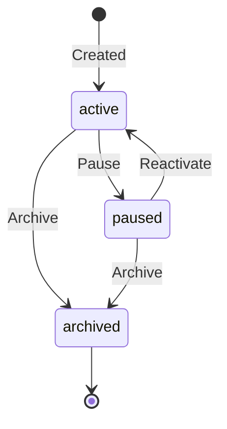
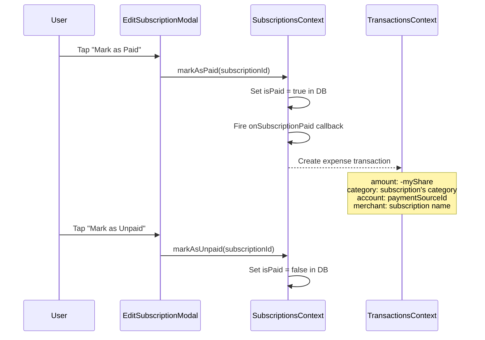

# Subscriptions Architecture

> How Sikka manages recurring payments with split billing, lifecycle events, and transaction sync.

---

## Data Model

```typescript
interface Subscription {
    id: string;
    name: string;
    icon: string;              // MaterialIcon name
    iconColor: string;         // Icon background color

    // Amounts
    totalAmount: number;       // Full bill to merchant (₹800)
    myShare: number;           // My actual cost (₹200 if split 4-ways)
    amount: number;            // = myShare (backward-compat alias)

    // Billing
    dueDate: number;           // Day of month (1-31)
    billingCycle: 'monthly' | 'yearly';
    category: string;          // e.g. "streaming", "cloud", "fitness"

    // Role & Split
    role: 'admin' | 'member';
    isSplit: boolean;
    splitMembers: SplitMember[];

    // Payment Source
    paymentSourceId?: string;  // Linked Account.id
    paymentMode: 'default' | 'ask_every_time';
    payTo?: string;            // Member-only: friend who pays the merchant

    // Lifecycle
    status: 'active' | 'paused' | 'archived';
    isPaid: boolean;           // Paid THIS cycle?
    eventLog: SubscriptionEvent[];
}
```

---

## Role System



| Role | Who pays merchant? | `totalAmount` | `myShare` | `splitMembers` |
|---|---|---|---|---|
| **Admin** | Me | ₹800 (full bill) | ₹200 | Friends who owe me |
| **Member** | Someone else | ₹800 (for reference) | ₹200 | N/A |

---

## Split Members

When `isSplit = true` and `role = 'admin'`, the subscription tracks who owes what:

```typescript
interface SplitMember {
    name: string;            // "Rahul", "Priya"
    amount: number;          // ₹200
    status: 'pending' | 'paid';
}
```

The admin can mark individual members as paid/pending through `updateSplitMemberStatus()`.

---

## Lifecycle State Machine



Every state transition is logged as an immutable **event**:

```typescript
interface SubscriptionEvent {
    type: 'created' | 'paused' | 'reactivated' | 'price_updated' | 'archived';
    timestamp: number;
    details?: string;          // e.g. "Price: ₹199 → ₹299"
}
```

---

## Payment Cycle

Each billing cycle, subscriptions need to be marked as paid:



### Transaction Sync Bridge

The `SubscriptionsWithTransactionSync` wrapper in `App.tsx` bridges the two contexts:

```
SubscriptionsProvider
    → onSubscriptionPaid callback
    → calls TransactionsContext.addTransaction
    → creates expense linked to the subscription's payment source account
```

---

## Computed Properties

The `SubscriptionsContext` provides several derived values:

| Property | Computation |
|---|---|
| `activeSubscriptions` | `status === 'active'` |
| `monthlyTotal` | Sum of `myShare` for active monthly subs |
| `yearlyTotal` | Sum of `myShare` for active yearly subs |
| `totalMonthlyBurn` | `monthlyTotal + (yearlyTotal / 12)` |
| `upcomingDue` | Active subs sorted by proximity to due date |
| `overdue` | Active, unpaid subs past their due date |

---

## CRUD Operations

| Method | Description |
|---|---|
| `addSubscription(data)` | Creates sub + optional split members + 'created' event |
| `updateSubscription(id, updates)` | Partial update, logs price changes as events |
| `pauseSubscription(id)` | Sets status='paused', logs event |
| `reactivateSubscription(id)` | Sets status='active', logs event |
| `archiveSubscription(id)` | Sets status='archived', logs event |
| `markAsPaid(id)` | Sets isPaid=true, triggers transaction creation |
| `markAsUnpaid(id)` | Sets isPaid=false |
| `updateSplitMemberStatus(subId, name, status)` | Toggle a member's payment status |
| `getEventLog(id)` | Returns the immutable event history |

---

## Database Tables

### `subscriptions`
Main subscription record with all fields.

### `subscription_members`
One row per split member:
```
| subscription_id | name   | amount | status  |
|----------------|--------|--------|---------|
| sub_001        | Rahul  | 200    | pending |
| sub_001        | Priya  | 200    | paid    |
```

### `subscription_events`
Immutable audit trail:
```
| subscription_id | type           | timestamp    | details              |
|----------------|----------------|--------------|----------------------|
| sub_001        | created        | 1708300000   |                      |
| sub_001        | price_updated  | 1710000000   | Price: ₹199 → ₹299 |
| sub_001        | paused         | 1712000000   |                      |
```
