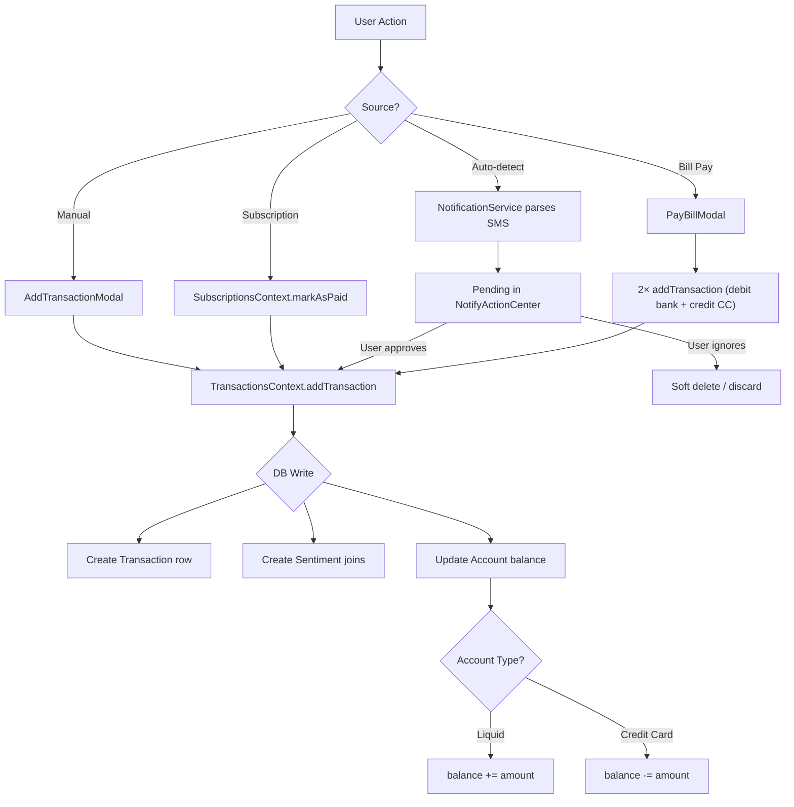
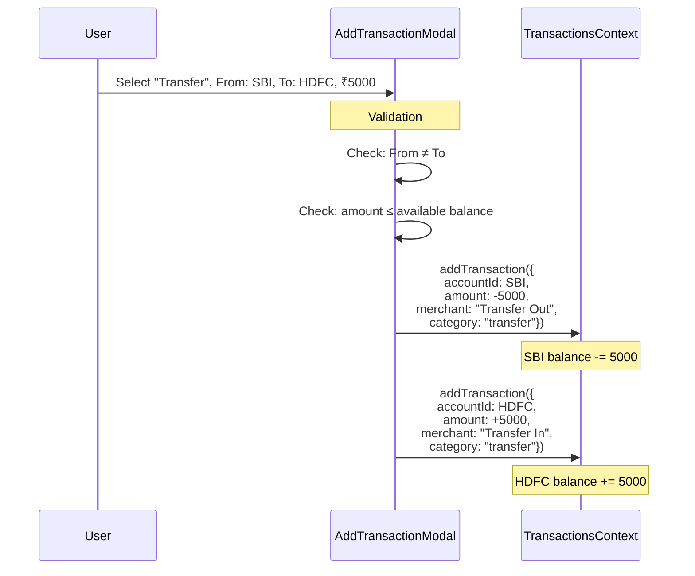
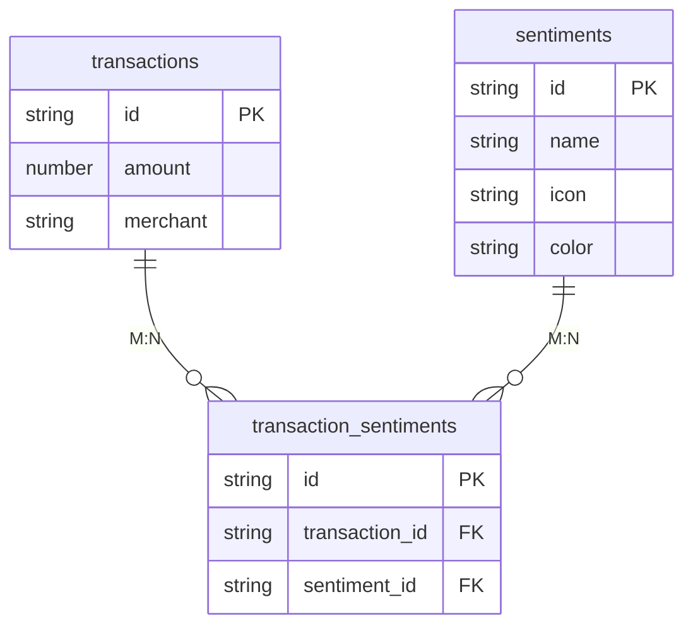
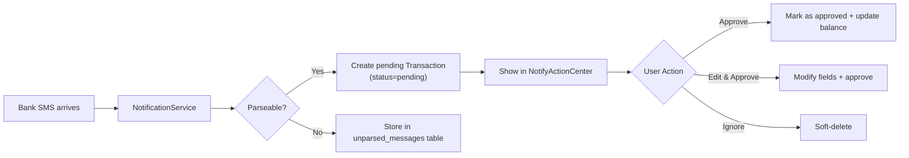

# Transactions Architecture

> How Sikka creates, stores, and manages financial transactions with type-aware balance updates.

---

## Transaction Data Model

```typescript
interface Transaction {
    id: string;
    accountId: string;              // FK → accounts
    merchant: string;               // Title/payee name
    category: TransactionCategory;  // 'groceries' | 'dining' | 'transfer' | ...
    type: 'credit' | 'debit';      // DB-level direction
    amount: number;                 // Negative for expenses, positive for income
    status?: 'pending' | 'approved' | 'ignored';  // Workflow status
    notes?: string;
    timestamp: number;              // Unix ms for sorting
    isAuto: boolean;                // Auto-detected from SMS/notification
    sentimentIds?: string[];        // Many-to-many → sentiments table
    isDeleted?: boolean;            // Soft-delete flag
}
```

### Category Enum

```
groceries | dining | transport | shopping | entertainment
utilities | health | income    | transfer | other
```

---

## Transaction Lifecycle



---

## Balance Update Logic

This is the most critical piece of the transaction system. **The balance update is type-aware** — it inverts for credit cards.

### Why the Inversion?

For a liquid account (bank/cash), spending ₹500 means:
```
amount = -500
balance += -500  →  balance decreases by 500  ✓
```

For a credit card, spending ₹500 means your **debt increases**:
```
amount = -500
balance -= -500  →  balance increases by 500  (debt goes up)  ✓
```

### Code

```typescript
// In TransactionsContext.addTransaction:
await account.update(acc => {
    if (account.type === 'credit') {
        acc.balance -= transactionData.amount;  // Inverted for CC
    } else {
        acc.balance += transactionData.amount;  // Normal for liquid
    }
});
```

### Balance Reversal on Delete

When a transaction is soft-deleted, the balance change is reversed:

```typescript
// In TransactionsContext.deleteTransaction:
await account.update(acc => {
    if (account.type === 'credit') {
        acc.balance += amount;  // Reverse: undo the -= from addTransaction
    } else {
        acc.balance -= amount;  // Reverse: undo the += from addTransaction
    }
});
```

---

## Transfer Flow (2 Linked Transactions)

A transfer between accounts creates **2 separate transactions** inside `AddTransactionModal`:



### CC Bill Payment (Same Pattern)

The `PayBillModal` follows the same 2-transaction pattern:

| Transaction | Account | Amount | Merchant |
|---|---|---|---|
| 1 (Debit) | Bank account | `-₹X` | "CC Bill Payment — Axis CC" |
| 2 (Credit) | Credit card | `+₹X` | "Bill Payment from SBI" |

---

## Transaction-to-Category Mapping

Categories are stored in a separate `categories` table and linked to transactions via a foreign key (`category_id`). During hydration, the category name is resolved:

```typescript
// In the observe() subscription:
let categoryName: TransactionCategory = 'other';
try {
    const cat = await tx.category.fetch();
    if (cat) {
        categoryName = cat.name.toLowerCase() as TransactionCategory;
    }
} catch (e) { /* category might be null */ }
```

---

## Sentiments (Many-to-Many)

Transactions can be tagged with emotional sentiments (Joy, Regret, Impulse, etc.) via a **join table**:



### Creating Sentiment Joins

```typescript
if (transactionData.sentimentIds?.length > 0) {
    const sentimentRecords = await db.get('sentiments')
        .query(Q.where('id', Q.oneOf(sentimentIds))).fetch();

    for (const sentiment of sentimentRecords) {
        await tsCollection.create(ts => {
            ts.transaction.set(newTx);
            ts.sentiment.set(sentiment);
        });
    }
}
```

---

## Auto-Detected Transactions (SMS Parsing)

The `NotificationService` listens for bank SMS/notifications and attempts to parse them into transactions:



---

## Transaction Validation

`AddTransactionModal` performs type-aware validation before creating transactions:

```typescript
function getSpendableAmount(account: Account): number {
    if (account.type === 'credit' && account.creditCardDetails) {
        // CC: available credit = limit - outstanding
        return account.creditCardDetails.creditLimit - Math.abs(account.balance);
    }
    return account.balance;  // Liquid: simple balance
}
```

| Check | For Expenses | For Transfers |
|---|---|---|
| Amount > 0 | ✓ Required | ✓ Required |
| Amount ≤ spendable | ✓ (type-aware) | ✓ From-account only |
| From ≠ To | N/A | ✓ |
| Investment/Crypto blocked | ✓ Filtered out | ✓ Filtered out |

---

## Context API

The `TransactionsContext` provides:

| Method/Property | Description |
|---|---|
| `transactions` | All transactions (including deleted) |
| `activeTransactions` | Non-deleted, sorted by timestamp desc |
| `todayTransactions` | Today's active transactions |
| `addTransaction(data)` | Create + update balance + create sentiment joins |
| `deleteTransaction(id)` | Soft-delete + reverse balance |
| `getTransactionsByAccount(id)` | Filter by account ID |
| `getTransactionsByDate(date)` | Filter by specific date |
| `approveTransaction(id, updates?)` | Approve a pending auto-detected transaction |
| `ignoreTransaction(id)` | Reject a pending transaction |
| `unparsedNotifications` | SMS messages that couldn't be parsed |
| `refreshTransactions()` | Force re-fetch from DB |

### Real-Time Updates

The context uses WatermelonDB's `observe()` to subscribe to the transactions table. Any DB change automatically triggers a re-render:

```typescript
transactionsCollection.query(Q.sortBy('timestamp', Q.desc))
    .observe()
    .subscribe(async (records) => {
        const mapped = await Promise.all(records.map(hydrate));
        setTransactions(mapped);
    });
```
